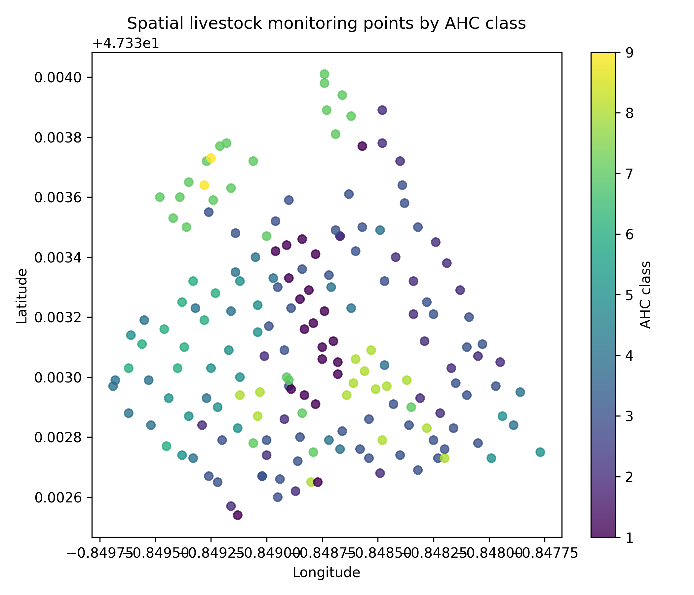
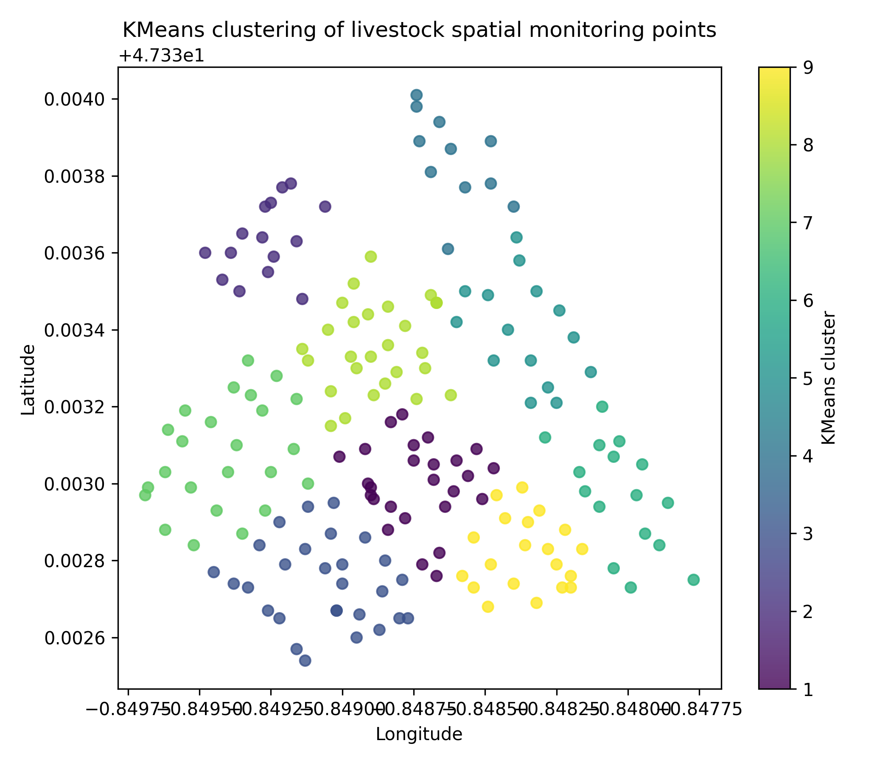
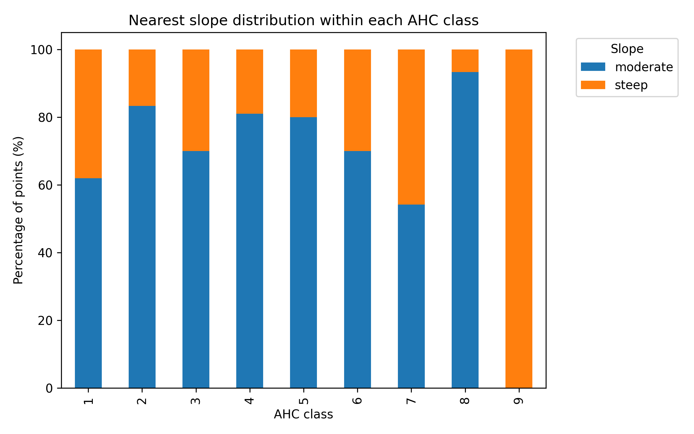

# Livestock Spatial Sensor Analytics

This mini-project demonstrates a Python-based workflow for spatial livestock monitoring data.

The workflow uses grazing-related spatial data and AHC-classified monitoring points to explore livestock movement and spatial behavior patterns. The project is designed as a small applied example relevant to precision livestock farming, sensor-based monitoring, and data-driven agricultural research.

## Workflow

- Load spatial livestock monitoring data
- Visualize AHC-based spatial clusters
- Explore environmental context such as slope
- Prepare the basis for AI-assisted interpretation of livestock spatial behavior

## Tools

- Python
- pandas
- matplotlib
- scikit-learn

## Example Results

### Spatial AHC classification

### KMeans clustering

### Slope distribution by cluster

## Relevance

This project connects agricultural data analysis, sensor-based monitoring, and precision livestock farming.

## Data Source

The dataset used in this project originates from the supplementary materials of the following publication:

Riaboff et al. (2020).Use of Predicted Behavior from Accelerometer Data Combined with GPS Data to Explore the Relationship between Dairy Cow Behavior and Pasture Characteristics.
Sensors, 20(17), 4741.

Available at:
https://www.mdpi.com/1424-8220/20/17/4741

Supplementary material:
https://www.mdpi.com/1424-8220/20/17/4741/s1

The original dataset was adapted for demonstrating Python-based spatial livestock analytics and AI-assisted clustering workflows.
